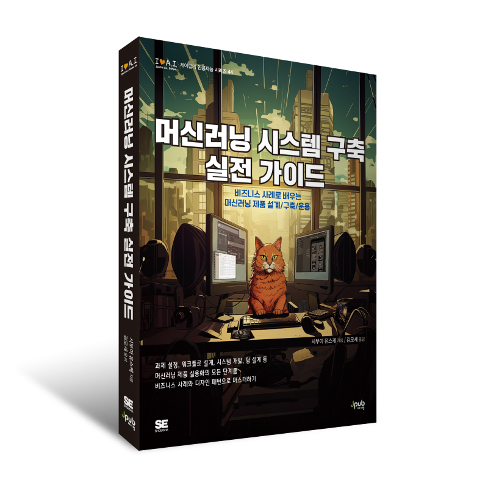

# Lecture 1435: Machine Learning System Design

## [머신러닝 시스템 구축 실전 가이드 \~비즈니스 사례로 배우는 머신러닝 제품 설계/구축/운용\~](https://www.amazon.co.jp/%E7%8F%BE%E5%A0%B4%E3%81%A7%E4%BD%BF%E3%81%88%E3%82%8B-%E6%A9%9F%E6%A2%B0%E5%AD%A6%E7%BF%92%E3%82%B7%E3%82%B9%E3%83%86%E3%83%A0%E6%A7%8B%E7%AF%89%E5%AE%9F%E8%B7%B5%E3%82%AC%E3%82%A4%E3%83%89-%E3%83%87%E3%82%B6%E3%82%A4%E3%83%B3%E3%83%91%E3%82%BF%E3%83%BC%E3%83%B3%E3%82%92%E5%88%A9%E7%94%A8%E3%81%97%E3%81%9F%E6%9C%80%E9%81%A9%E3%81%AA%E8%A8%AD%E8%A8%88%E3%83%BB%E6%A7%8B%E7%AF%89%E3%83%BB%E9%81%8B%E7%94%A8%E6%89%8B%E6%B3%95-%E6%BE%81%E4%BA%95-%E9%9B%84%E4%BB%8B/dp/4798173401?&linkCode=ll1&tag=shibuiyusuke-22&linkId=6c46b03d1099edcb61988f6b37247ed8&language=ja_JP&ref_=as_li_ss_tl) 샘플 프로그램

이 저장소는 제입펍에서 발간하는 [머신러닝 시스템 구축 실전 가이드 \~비즈니스 사례로 배우는 머신러닝 제품 설계/구축/운용\~](https://www.amazon.co.jp/%E7%8F%BE%E5%A0%B4%E3%81%A7%E4%BD%BF%E3%81%88%E3%82%8B-%E6%A9%9F%E6%A2%B0%E5%AD%A6%E7%BF%92%E3%82%B7%E3%82%B9%E3%83%86%E3%83%A0%E6%A7%8B%E7%AF%89%E5%AE%9F%E8%B7%B5%E3%82%AC%E3%82%A4%E3%83%89-%E3%83%87%E3%82%B6%E3%82%A4%E3%83%B3%E3%83%91%E3%82%BF%E3%83%BC%E3%83%B3%E3%82%92%E5%88%A9%E7%94%A8%E3%81%97%E3%81%9F%E6%9C%80%E9%81%A9%E3%81%AA%E8%A8%AD%E8%A8%88%E3%83%BB%E6%A7%8B%E7%AF%89%E3%83%BB%E9%81%8B%E7%94%A8%E6%89%8B%E6%B3%95-%E6%BE%81%E4%BA%95-%E9%9B%84%E4%BB%8B/dp/4798173401?&linkCode=ll1&tag=shibuiyusuke-22&linkId=6c46b03d1099edcb61988f6b37247ed8&language=ja_JP&ref_=as_li_ss_tl) 샘플 프로그램 모음입니다. 

이 저장소에서는 비즈니스 과제에 대해 머신러닝 시스템을 End-to-end로 만들어 봅니다. 
이 저장소에서는 다음 시스템을 제공합니다.

- [`chapter2_demand_forecasting_with_ml`](./chapter2_demand_forecasting_with_ml): 가공의 식료품 판매점 `AI 상점`에서 식료품의 수요 예측을 실시합니다.
- [`chapter3_4_aianimals`](./chapter3_4_aianimals): 가공의 동물 이미지 게시 스마트폰 애플리케이션 `AIAnimals`에서 머신러닝을 활용합니다.

