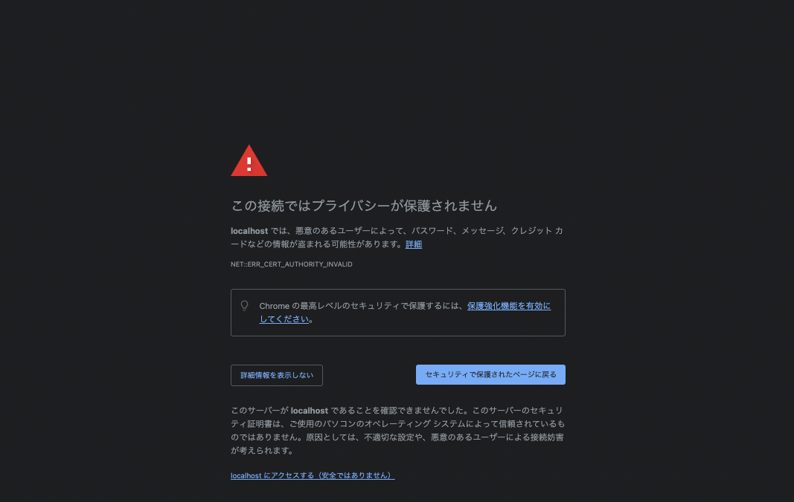
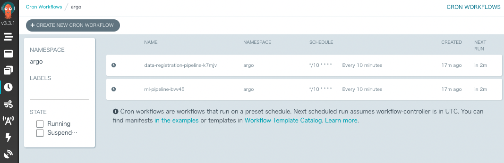
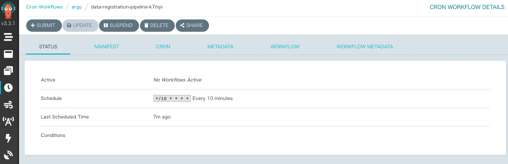
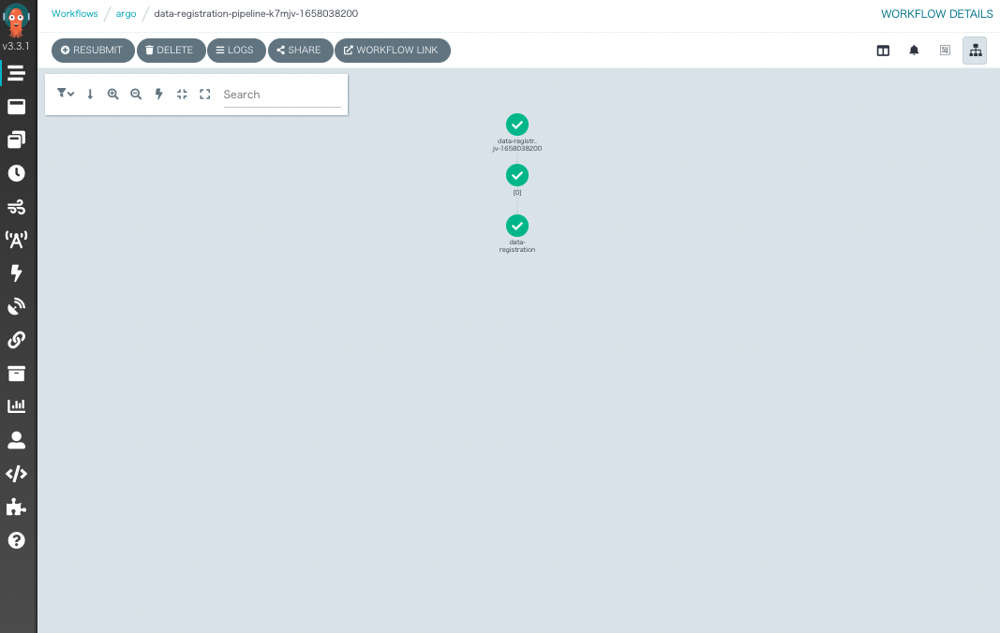
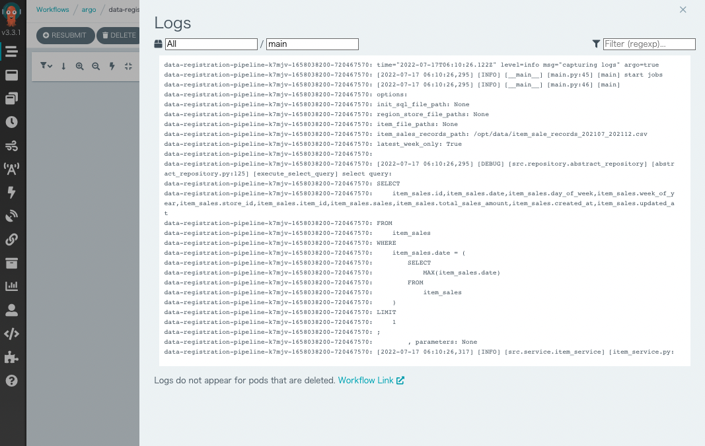
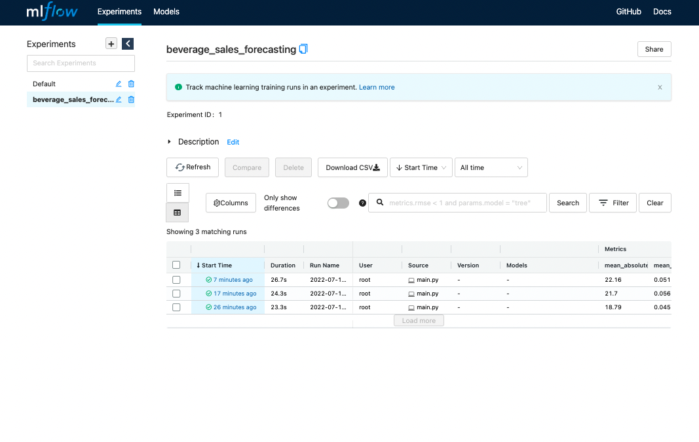
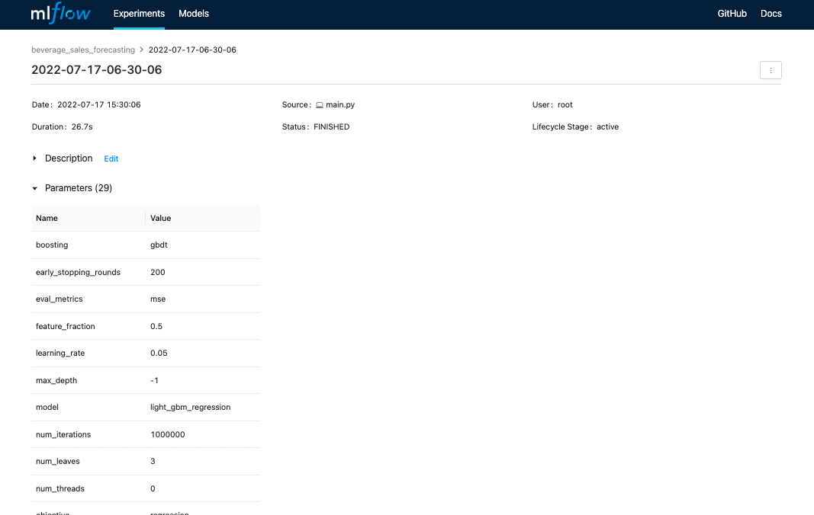
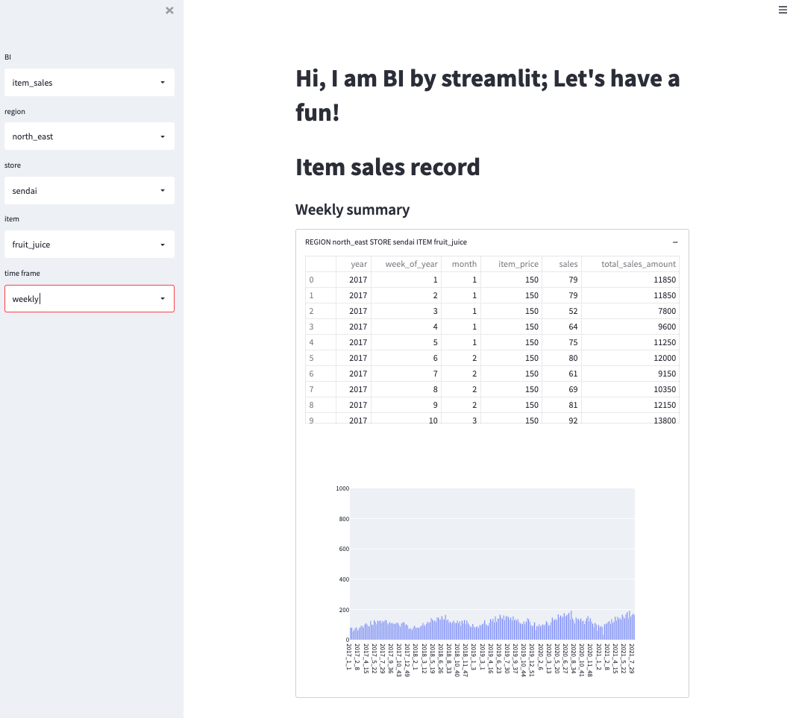
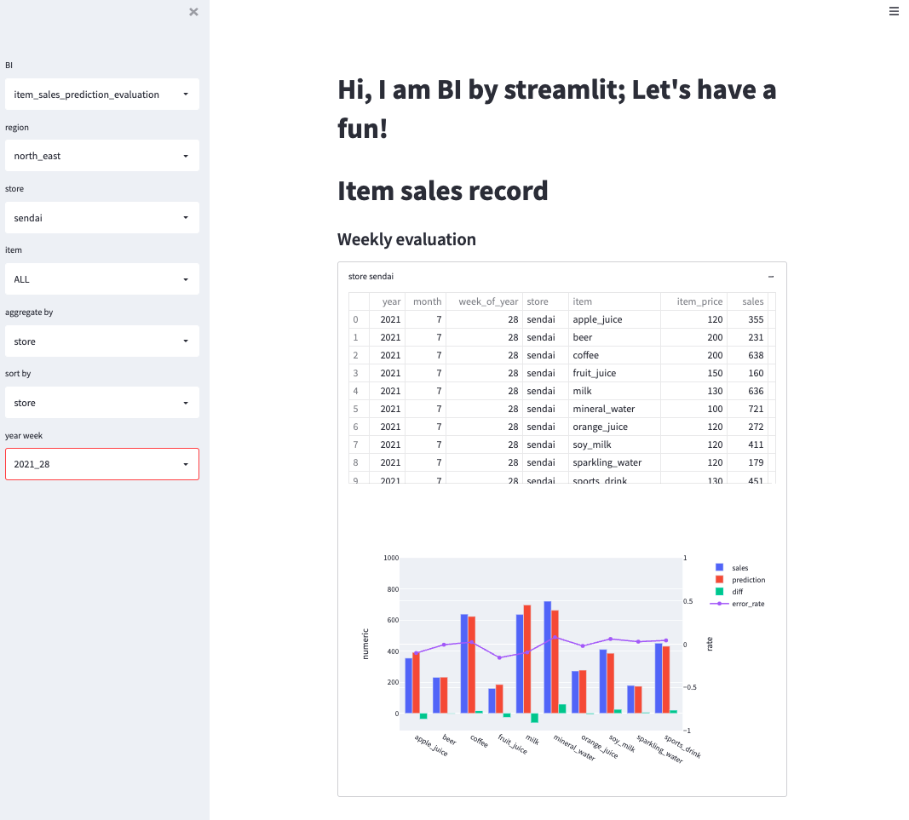

# Stage 1

`Stage1`에서는 쿠버네티스 클러스터로 식료품 수요 예측 모델을 학습, 평가, 추론합니다.

- 다음 명령어는 모두 로컬 터미널에서 실행합니다.
- 모든 리소스는 쿠버네티스 클러스트에 배포해서 기동합니다.
- 모든 명령어의 실행은 Linux 및 macOS에서 기동을 확인했습니다.


## 요구사항

- [Docker Engine](https://docs.docker.com/engine/install/)
- [Kubernetes](https://kubernetes.io/ko/)
  - 쿠버네티스 클러스터에서는 노드 합계 12cpu 이상, 48GB 이상의 메모리가 필요합니다.
- `make` 명령어의 실행 환경
- [kubectl](https://kubernetes.io/ko/docs/tasks/tools/)의 실행 환경
  - `kubectl`은 [공식 문서](https://kubernetes.io/ko/docs/tasks/tools/)를 참조해서 설치하기 바랍니다.
- [argo cli](https://github.com/argoproj/argo-workflows/releases)의 실행 환경
  - argo cli는 [공식 문서](https://github.com/argoproj/argo-workflows/releases)를 참조해서 설치하기 바랍니다.

## 컴포넌트

- [MLflow tracking server](https://www.mlflow.org/docs/latest/index.html): 머신러닝 학습 결과를 관리하는 서버.
- [PostgreSQL database](https://www.postgresql.org/): 식료품 판매 실적 및 MLflow 데이터를 저장하는 데이터베이스.
- BI: [streamlit](https://streamlit.io/)으로 구축하는 BI 환경.
- [Argo Workflows](https://argoproj.github.io/argo-workflows/): 워크플로 실행 환경.
- 데이터 등록 잡: 정기적으로 판매 실적 데이터를 등록하는 잡. Argo Workflows에서 잡으로 실행된다.
- 식료품 수요 예측 잡: 정기적으로 식료품의 수요를 예측하는 머신러닝 모델을 학습하고, 추론하는 잡. Argo Workflows에서 잡으로 실행된다.

## 시작하기

### 1. 도커 이미지 빌드

도커 이미지를 빌드합니다.

- 빌드 명령은 `make build_all`입니다.
- 빌드 완료한 도커 이미지는 다음에서 제공합니다.
  - https://hub.docker.com/repository/docker/shibui/building-ml-system/general
  - `make pull_all`로 도커 이미지를 얻을 수 있습니다.

<details> <summary>도커 build 로그</summary>

```shell
# 도커 이미지 빌드
$ make build_all
docker build \
		--platform x86_64 \
		-t shibui/building-ml-system:beverage_sales_forecasting_data_registration_1.0.0 \
		-f ~/building-ml-system/chapter2_demand_forecasting_with_ml/stage1/data_registration/Dockerfile \
		.
[+] Building 79.7s (11/11) FINISHED
 => [internal] load build definition from Dockerfile                                                                           0.0s
 => => transferring dockerfile: 486B                                                                                           0.0s
 => [internal] load .dockerignore                                                                                              0.0s
 => => transferring context: 2B                                                                                                0.0s
 => [internal] load metadata for docker.io/library/python:3.9.7-slim                                                           1.9s
 => [auth] library/python:pull token for registry-1.docker.io                                                                  0.0s
 => [internal] load build context                                                                                              0.0s
 => => transferring context: 45.54kB                                                                                           0.0s
 => [1/5] FROM docker.io/library/python:3.9.7-slim@sha256:aef632387d994b410de020dfd08fb1d9b648fc8a5a44f332f7ee326c8e170dba     0.0s
 => CACHED [2/5] WORKDIR /opt                                                                                                  0.0s
 => [3/5] COPY data_registration/requirements.txt /opt/                                                                        0.0s
 => [4/5] RUN apt-get -y update &&     apt-get -y install     apt-utils     wget     curl     gcc &&     apt-get clean &&     77.2s
 => [5/5] COPY data_registration/src/ /opt/src/                                                                                0.0s
 => exporting to image                                                                                                         0.6s
 => => exporting layers                                                                                                        0.6s
 => => writing image sha256:f069b0e6885297c450caf2475e0b121938154e0cda16bdf18d56ef3348bf4f5c                                   0.0s
 => => naming to docker.io/shibui/building-ml-system:beverage_sales_forecasting_data_registration_1.0.0                        0.0s

Use 'docker scan' to run Snyk tests against images to find vulnerabilities and learn how to fix them
docker build \
		--platform x86_64 \
		-t shibui/building-ml-system:beverage_sales_forecasting_ml_1.0.0 \
		-f ~/building-ml-system/chapter2_demand_forecasting_with_ml/stage1/ml/Dockerfile \
		.
[+] Building 400.7s (11/11) FINISHED
 => [internal] load build definition from Dockerfile                                                                           0.0s
 => => transferring dockerfile: 497B                                                                                           0.0s
 => [internal] load .dockerignore                                                                                              0.0s
 => => transferring context: 2B                                                                                                0.0s
 => [internal] load metadata for docker.io/library/python:3.9.7-slim                                                           0.9s
 => [1/6] FROM docker.io/library/python:3.9.7-slim@sha256:aef632387d994b410de020dfd08fb1d9b648fc8a5a44f332f7ee326c8e170dba     0.0s
 => [internal] load build context                                                                                              0.0s
 => => transferring context: 78.44kB                                                                                           0.0s
 => CACHED [2/6] WORKDIR /opt                                                                                                  0.0s
 => [3/6] COPY ml/requirements.txt /opt/                                                                                       0.0s
 => [4/6] RUN apt-get -y update &&     apt-get -y install     apt-utils     gcc &&     apt-get clean &&     rm -rf /var/lib  396.9s
 => [5/6] COPY ml/src/ /opt/src/                                                                                               0.0s
 => [6/6] COPY ml/hydra/ /opt/hydra/                                                                                           0.0s
 => exporting to image                                                                                                         2.8s
 => => exporting layers                                                                                                        2.8s
 => => writing image sha256:753f406c72f424fe9e36dbfdcdacf996970e4bc0e008c0714df4f583df8a7340                                   0.0s
 => => naming to docker.io/shibui/building-ml-system:beverage_sales_forecasting_ml_1.0.0                                       0.0s

Use 'docker scan' to run Snyk tests against images to find vulnerabilities and learn how to fix them
docker build \
		--platform x86_64 \
		-t shibui/building-ml-system:beverage_sales_forecasting_mlflow_1.0.0 \
		-f ~/building-ml-system/chapter2_demand_forecasting_with_ml/stage1/mlflow/Dockerfile \
		.
[+] Building 170.8s (8/8) FINISHED
 => [internal] load build definition from Dockerfile                                                                           0.0s
 => => transferring dockerfile: 367B                                                                                           0.0s
 => [internal] load .dockerignore                                                                                              0.0s
 => => transferring context: 2B                                                                                                0.0s
 => [internal] load metadata for docker.io/library/python:3.9-slim                                                             1.7s
 => [auth] library/python:pull token for registry-1.docker.io                                                                  0.0s
 => [1/3] FROM docker.io/library/python:3.9-slim@sha256:ea93ec4fbe8ee1c62397410c0d1f342a33199e98cd59adac6964b38e410e8246       0.0s
 => CACHED [2/3] WORKDIR /opt                                                                                                  0.0s
 => [3/3] RUN pip install mlflow sqlalchemy psycopg2-binary google-cloud-storage azure-storage-blob boto3                    167.4s
 => exporting to image                                                                                                         1.7s
 => => exporting layers                                                                                                        1.7s
 => => writing image sha256:07d9f4d94bc86cd061f2f1ae72cf9ea9836aacface840b1e4d3039f68966010e                                   0.0s
 => => naming to docker.io/shibui/building-ml-system:beverage_sales_forecasting_mlflow_1.0.0                                   0.0s

Use 'docker scan' to run Snyk tests against images to find vulnerabilities and learn how to fix them
docker build \
		--platform x86_64 \
		-t shibui/building-ml-system:beverage_sales_forecasting_bi_1.0.0 \
		-f ~/building-ml-system/chapter2_demand_forecasting_with_ml/stage1/bi/Dockerfile \
		.
[+] Building 278.9s (10/10) FINISHED
 => [internal] load build definition from Dockerfile                                                                           0.0s
 => => transferring dockerfile: 492B                                                                                           0.0s
 => [internal] load .dockerignore                                                                                              0.0s
 => => transferring context: 2B                                                                                                0.0s
 => [internal] load metadata for docker.io/library/python:3.9.7-slim                                                           0.8s
 => [1/5] FROM docker.io/library/python:3.9.7-slim@sha256:aef632387d994b410de020dfd08fb1d9b648fc8a5a44f332f7ee326c8e170dba     0.0s
 => [internal] load build context                                                                                              0.0s
 => => transferring context: 44.59kB                                                                                           0.0s
 => CACHED [2/5] WORKDIR /opt                                                                                                  0.0s
 => [3/5] COPY bi/requirements.txt /opt/                                                                                       0.0s
 => [4/5] RUN apt-get -y update &&     apt-get -y install     apt-utils     gcc &&     apt-get clean &&     rm -rf /var/lib  274.7s
 => [5/5] COPY bi/src/ /opt/src/                                                                                               0.0s
 => exporting to image                                                                                                         3.3s
 => => exporting layers                                                                                                        3.3s
 => => writing image sha256:bd758bce5675ae120568b2631524b4734b344e62f0011fc2186e1af0270f27de                                   0.0s
 => => naming to docker.io/shibui/building-ml-system:beverage_sales_forecasting_bi_1.0.0                                       0.0s

Use 'docker scan' to run Snyk tests against images to find vulnerabilities and learn how to fix them
```

</details>

### 2. 환경 구축

- 쿠버네티스 클러스터에 식료품 수요 예측 실행 환경을 구축합니다.
- 쿠버네티스 클러스터에 다음을 구축합니다.
  - data namespace: PostgreSQL database를 배포.
  - mlflow namespace: MLflow Tracking Server를 배포.
  - argo namespace: Argo Workflows를 배포.
  - beverage-sales-forecasting namespace: 초기 데이터 등록 잡 및 streamlit을 사용한 BI 환경을 배포.

<details> <summary>쿠버네티스 클러스터에서의 환경 구축 로그</summary>

```sh
# 쿠버네티스 클러스터에 초기 설정 도입
$ make initialize_deployment
kubectl apply -f /Users/user/book2/building-ml-system/chapter2_demand_forecasting_with_ml/stage1/infrastructure/manifests/kube_system/pdb.yaml
poddisruptionbudget.policy/event-exporter-gke created
poddisruptionbudget.policy/konnectivity-agent created
poddisruptionbudget.policy/kube-dns-autoscaler created
poddisruptionbudget.policy/kube-dns created
poddisruptionbudget.policy/glbc created
poddisruptionbudget.policy/metrics-server created

# 각종 리소스 배포
$ make deploy_base
kubectl apply -f /Users/user/book2/building-ml-system/chapter2_demand_forecasting_with_ml/stage1/infrastructure/manifests/argo/namespace.yaml
namespace/argo created
namespace: argo
secret/regcred created
kubectl \
		-n argo apply \
		-f /Users/user/book2/building-ml-system/chapter2_demand_forecasting_with_ml/stage1/infrastructure/manifests/argo/argo_clusterrolebinding.yaml && \
	kubectl \
		-n argo apply \
		-f https://github.com/argoproj/argo-workflows/releases/download/v3.3.1/quick-start-postgres.yaml
serviceaccount/user-admin created
clusterrolebinding.rbac.authorization.k8s.io/argo-cluster-admin-binding created
customresourcedefinition.apiextensions.k8s.io/clusterworkflowtemplates.argoproj.io created
customresourcedefinition.apiextensions.k8s.io/cronworkflows.argoproj.io created
customresourcedefinition.apiextensions.k8s.io/workfloweventbindings.argoproj.io created
customresourcedefinition.apiextensions.k8s.io/workflows.argoproj.io created
customresourcedefinition.apiextensions.k8s.io/workflowtaskresults.argoproj.io created
customresourcedefinition.apiextensions.k8s.io/workflowtasksets.argoproj.io created
customresourcedefinition.apiextensions.k8s.io/workflowtemplates.argoproj.io created
serviceaccount/argo created
serviceaccount/argo-server created
serviceaccount/github.com created
role.rbac.authorization.k8s.io/agent created
role.rbac.authorization.k8s.io/argo-role created
role.rbac.authorization.k8s.io/argo-server-role created
role.rbac.authorization.k8s.io/executor created
role.rbac.authorization.k8s.io/pod-manager created
role.rbac.authorization.k8s.io/submit-workflow-template created
role.rbac.authorization.k8s.io/workflow-manager created
clusterrole.rbac.authorization.k8s.io/argo-clusterworkflowtemplate-role created
clusterrole.rbac.authorization.k8s.io/argo-server-clusterworkflowtemplate-role created
rolebinding.rbac.authorization.k8s.io/agent-default created
rolebinding.rbac.authorization.k8s.io/argo-binding created
rolebinding.rbac.authorization.k8s.io/argo-server-binding created
rolebinding.rbac.authorization.k8s.io/executor-default created
rolebinding.rbac.authorization.k8s.io/github.com created
rolebinding.rbac.authorization.k8s.io/pod-manager-default created
rolebinding.rbac.authorization.k8s.io/workflow-manager-default created
clusterrolebinding.rbac.authorization.k8s.io/argo-clusterworkflowtemplate-role-binding created
clusterrolebinding.rbac.authorization.k8s.io/argo-server-clusterworkflowtemplate-role-binding created
configmap/artifact-repositories created
configmap/workflow-controller-configmap created
secret/argo-postgres-config created
secret/argo-server-sso created
secret/argo-workflows-webhook-clients created
secret/my-minio-cred created
service/argo-server created
service/minio created
service/postgres created
service/workflow-controller-metrics created
priorityclass.scheduling.k8s.io/workflow-controller created
deployment.apps/argo-server created
deployment.apps/minio created
deployment.apps/postgres created
deployment.apps/workflow-controller created
kubectl apply -f /Users/user/book2/building-ml-system/chapter2_demand_forecasting_with_ml/stage1/infrastructure/manifests/data/namespace.yaml
namespace/data created
namespace: data
secret/regcred created
kubectl apply -f /Users/user/book2/building-ml-system/chapter2_demand_forecasting_with_ml/stage1/infrastructure/manifests/data/postgres.yaml
deployment.apps/postgres created
service/postgres created
kubectl apply -f /Users/user/book2/building-ml-system/chapter2_demand_forecasting_with_ml/stage1/infrastructure/manifests/beverage_sales_forecasting/namespace.yaml
namespace/beverage-sales-forecasting created
namespace: beverage-sales-forecasting
secret/regcred created
kubectl apply -f /Users/user/book2/building-ml-system/chapter2_demand_forecasting_with_ml/stage1/infrastructure/manifests/beverage_sales_forecasting/bi.yaml
deployment.apps/bi created
service/bi created
kubectl apply -f /Users/user/book2/building-ml-system/chapter2_demand_forecasting_with_ml/stage1/infrastructure/manifests/mlflow/namespace.yaml
namespace/mlflow created
namespace: mlflow
secret/regcred created
kubectl apply -f /Users/user/book2/building-ml-system/chapter2_demand_forecasting_with_ml/stage1/infrastructure/manifests/mlflow/mlflow.yaml
deployment.apps/mlflow created
service/mlflow created

# 제공되는 namespace
$ kubectl get ns
NAME                         STATUS   AGE
argo                         Active   35s
beverage-sales-forecasting   Active   28s
data                         Active   28s
default                      Active   7m52s
kube-node-lease              Active   7m54s
kube-public                  Active   7m54s
kube-system                  Active   7m54s
mlflow                       Active   27s

# argo namespace의 리소스
$ kubectl -n argo get pods,deploy,svc
NAME                                                         READY   STATUS      RESTARTS      AGE
pod/argo-server-89b4c97d-5m5pz                               1/1     Running     3 (14m ago)   15m
pod/data-registration-pipeline-k7mjv-1658038200-720467570    0/2     Completed   0             10m
pod/data-registration-pipeline-k7mjv-1658038800-3234955156   0/2     Completed   0             16s
pod/minio-79566d86cb-6rkdw                                   1/1     Running     0             15m
pod/ml-pipeline-bvv45-1658038200-1084106428                  0/2     Completed   0             10m
pod/ml-pipeline-bvv45-1658038800-828320902                   2/2     Running     0             16s
pod/postgres-546d9d68b-q2gsb                                 1/1     Running     0             15m
pod/workflow-controller-59d644ffd9-rzz7h                     1/1     Running     3 (14m ago)   15m

NAME                                  READY   UP-TO-DATE   AVAILABLE   AGE
deployment.apps/argo-server           1/1     1            1           15m
deployment.apps/minio                 1/1     1            1           15m
deployment.apps/postgres              1/1     1            1           15m
deployment.apps/workflow-controller   1/1     1            1           15m

NAME                                  TYPE        CLUSTER-IP     EXTERNAL-IP   PORT(S)    AGE
service/argo-server                   ClusterIP   10.36.12.160   <none>        2746/TCP   15m
service/minio                         ClusterIP   10.36.11.94    <none>        9000/TCP   15m
service/postgres                      ClusterIP   10.36.9.163    <none>        5432/TCP   15m
service/workflow-controller-metrics   ClusterIP   10.36.8.100    <none>        9090/TCP   15m

# beverage-sales-forecasting namespace의 리소스
$ kubectl -n beverage-sales-forecasting get pods,deploy,svc
NAME                      READY   STATUS    RESTARTS   AGE
pod/bi-869fd59cdd-wcrh8   1/1     Running   0          42s

NAME                 READY   UP-TO-DATE   AVAILABLE   AGE
deployment.apps/bi   1/1     1            1           42s

NAME         TYPE        CLUSTER-IP    EXTERNAL-IP   PORT(S)    AGE
service/bi   ClusterIP   10.36.12.92   <none>        8501/TCP   42s

# data namespace의 리소스
$ kubectl -n data get pods,deploy,svc
NAME                           READY   STATUS    RESTARTS   AGE
pod/postgres-d79b99548-glqzz   1/1     Running   0          47s

NAME                       READY   UP-TO-DATE   AVAILABLE   AGE
deployment.apps/postgres   1/1     1            1           47s

NAME               TYPE        CLUSTER-IP    EXTERNAL-IP   PORT(S)    AGE
service/postgres   ClusterIP   10.36.2.224   <none>        5432/TCP   47s

# mlflow namespace의 리소스
$ kubectl -n mlflow get pods,deploy,svc
NAME                          READY   STATUS    RESTARTS   AGE
pod/mlflow-656f9cd66b-dmk6j   1/1     Running   0          15m
pod/mlflow-656f9cd66b-kvvtb   1/1     Running   0          15m

NAME                     READY   UP-TO-DATE   AVAILABLE   AGE
deployment.apps/mlflow   2/2     2            2           15m

NAME             TYPE        CLUSTER-IP    EXTERNAL-IP   PORT(S)    AGE
service/mlflow   ClusterIP   10.36.5.157   <none>        5000/TCP   15m
```

</details>

### 3. 쿠버네티스 클러스터에 구축한 환경에 접속

- 쿠버네티스 클러스터에 구축한 BI 환경, MLflow Tracking Server, Argo Workflows의 각 콘솔에는 `port-forward`를 실행해서 접속합니다.
- `port-forward` 명령은 [`./infrastructure/port_forward.sh`](./infrastructure/port_forward.sh)에서 제공합니다.

<details> <summary>쿠버네티스 클러스터의 각종 리소스에 접속하는 port-forward</summary>

```shell
# ./infrastructure/port_forward.shの内容
$ cat ./infrastructure/port_forward.sh
#!/bin/sh

kubectl -n beverage-sales-forecasting port-forward service/bi 8501:8501 &
kubectl -n mlflow port-forward service/mlflow 5000:5000 &
kubectl -n argo port-forward service/argo-server 2746:2746 &

# port-forward를 실행
$ ./infrastructure/port_forward.sh

# port-forward가 기동하는 것을 확인
$ ps aux | grep port-forward
user     52203   0.2  0.1 409281040  42448 s003  S     3:06PM   0:00.15 kubectl -n beverage-sales-forecasting port-forward service/bi 8501:8501
user     52750   0.0  0.0 407963504    624 s003  R+    3:08PM   0:00.00 grep port-forward
user     52205   0.0  0.1 409277280  44416 s003  S     3:06PM   0:00.16 kubectl -n argo port-forward service/argo-server 2746:2746
user     52204   0.0  0.1 409278704  45680 s003  S     3:06PM   0:00.20 kubectl -n mlflow port-forward service/mlflow 5000:5000
```

</details>

### 4. 학습 결과 실행

- 식료품 수요 예측 머신러닝은 Argo Workflows에 정기 실행되는 잡으로 등록합니다.
- 접속하기 위해서는 사전에 `port-forward`를 해야 합니다.
- [`env`](./env)에 기재되어 있는 환경 변수를 콘솔에 등록해야 합니다.
- 잡의 등록 명령어는 `make deploy_job`입니다.

<details> <summary>학습 잡 등록</summary>

```shell
# 콘솔에 등록되어 있는 환경 변수(일부)
$ env
ARGO_SERVER=127.0.0.1:2746
ARGO_HTTP1=true
ARGO_SECURE=true
ARGO_INSECURE_SKIP_VERIFY=true
ARGO_NAMESPACE=argo

# 잡 등록
$ make deploy_job
kubectl apply -f ~/building-ml-system/chapter2_demand_forecasting_with_ml/stage1/infrastructure/manifests/beverage_sales_forecasting/namespace.yaml
namespace/beverage-sales-forecasting unchanged
namespace: beverage-sales-forecasting
secret/regcred configured
kubectl apply -f ~/building-ml-system/chapter2_demand_forecasting_with_ml/stage1/infrastructure/manifests/beverage_sales_forecasting/initial_data_registration.yaml
job.batch/initial-data-registration configured
argo cron create infrastructure/manifests/argo/workflow/data_registration.yaml
Handling connection for 2746
Name:                          data-registration-pipeline-k7mjv
Namespace:                     argo
Created:                       Sun Jul 17 15:09:53 +0900 (now)
Schedule:                      */10 * * * *
Suspended:                     false
StartingDeadlineSeconds:       0
ConcurrencyPolicy:             Forbid
NextScheduledTime:             Sun Jul 17 15:10:00 +0900 (6 seconds from now) (assumes workflow-controller is in UTC)
argo cron create infrastructure/manifests/argo/workflow/ml.yaml
Handling connection for 2746
Name:                          ml-pipeline-bvv45
Namespace:                     argo
Created:                       Sun Jul 17 15:09:53 +0900 (now)
Schedule:                      */10 * * * *
Suspended:                     false
StartingDeadlineSeconds:       0
ConcurrencyPolicy:             Forbid
NextScheduledTime:             Sun Jul 17 15:10:00 +0900 (6 seconds from now) (assumes workflow-controller is in UTC)
```

</details>

- 등록된 잡은 Argo Workflows의 웹 콘솔에서 확인할 수 있습니다.
- 접속하기 위해 사전에 `port-forward`를 해야 합니다.
- URL: https://localhost:2746/
  - 그리고 위 URL에 로그인할 때, 다음과 같은 화면이 나타나는 경우가 있습니다. 이것은 HTTPS 인증서가 localhost에 대해 발행되어 있지 않기 때문입니다. `localhost`에 접근한다(안전하지 않습니다)`로 Argo Workflows의 웹 콘솔을 엽니다.



Argo Workflows에 등록된 cron 리스트



데이터 등록(Data registration) 내용.

- `*/10 * * * *`의 설정으로 10분마다 1번씩 실행합니다. 원래는 주 단위로 실행해야 하는 잡이지만, 데모 목적으로 10분 간격으로 실행합니다.



데이터 등록 잡 실행.



데이터 등록 잡 로그.



### 5. 수요 예측 기록

- 수요 예측의 학습 기록은 MLflow Tracking Server 및 BI 환경에서 열람할 수 있습니다.
- 각 콘솔에 접속하기 위해서는 사전에 `port-forward`를 해야 합니다.

#### MLflow tracking server

- URL: http://localhost:5000/

톱 페이지



학습 시의 파라미터



#### BI by streamlit

- URL: http://localhost:8501

판매 실적



판매 실적 대 추론 결과 평가



### 6. 환경 삭제

구축한 환경은 `make delete_namespaces`로 삭제할 수 있습니다.

```sh
$ make delete_namespaces
kubectl delete ns argo & \
	kubectl delete ns data & \
	kubectl delete ns mlflow & \
	kubectl delete ns beverage-sales-forecasting
namespace "data" deleted
namespace "argo" deleted
namespace "beverage-sales-forecasting" deleted
namespace "mlflow" deleted
```
